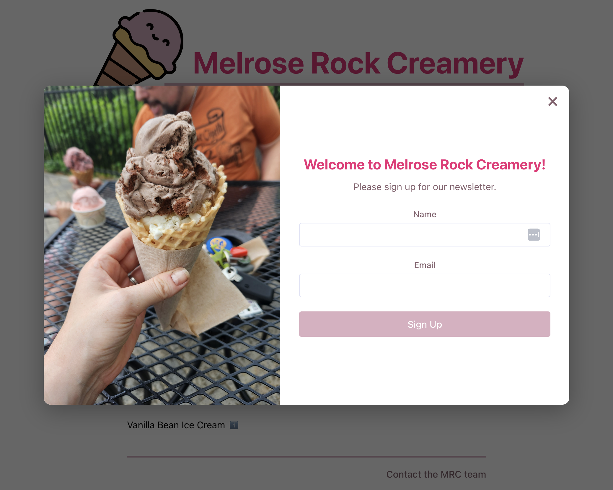
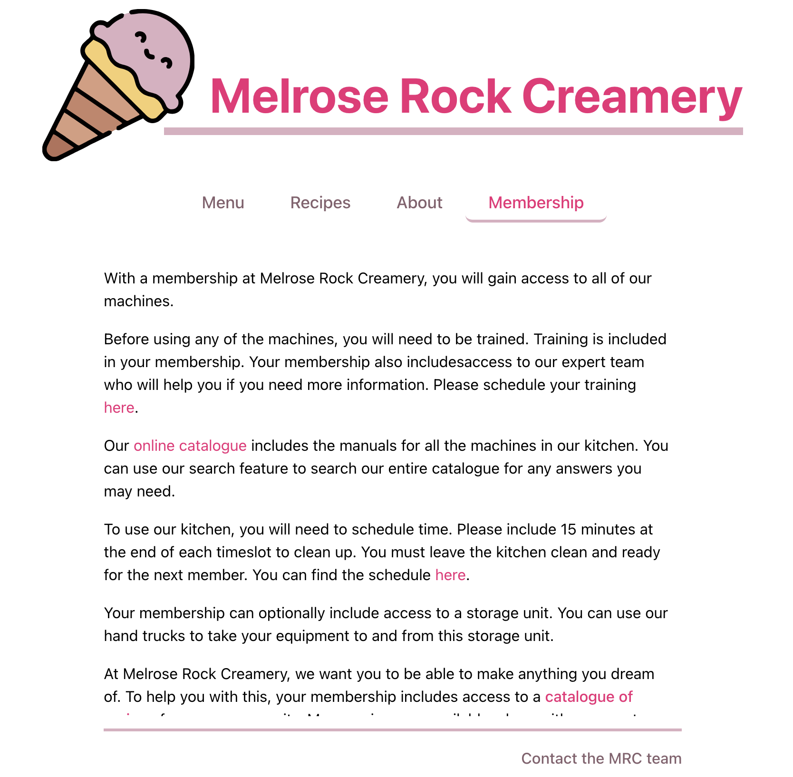
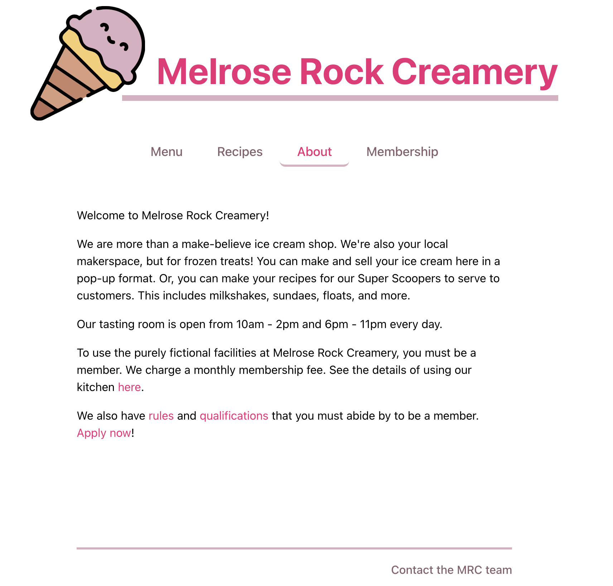

Welcome to Melrose Rock Creamery! This completely fictional makerspace-style kitchen is where your dreams come true. 

We are more than a make-believe ice cream shop. We're also your local makerspace, but for frozen treats! You can make and sell your ice cream here in a pop-up format. Or, you can make your recipes available for our Super Scoopers to serve to customers. This includes milkshakes, sundaes, floats, and more.

Our tasting room could be open from 10am - 2pm and 6pm - 11pm every day.

This project was created with [Cursor AI](https://cursor.com/home?from=agents). It's a Javascript/React and C#/.NET and PostgreSQL project. This is my first AI project and it's been fun to build. 

You can start the whole thing up with `docker-compose up -d --build`. You can destroy the whole thing with `docker-compose down -v && docker system prune -a -f` (be careful with this one). 
